# webStore - Finale project
=======

## description

For this application, I simulate a supermarket storefront interface, which is used for two kinds of users: client and manager.

in Client's interface, I allow the client to add/increase products in the amount needed to a shopping cart, which is displayed alongside and enables to decrease/delete products from the cart, and eventually transfer them to the order-form panel . in this form, the client is asked to enter shipping details and personal information so that the order process can be continued.
After the successful completion of the order, the client will receive an invoice by email and will receive an alert in the interface regarding the successful execution of the order and a direct link to the invoice that is also presented by email.

in Manager's interface, I allow the manager see the store's products, edit them and even add new products

## istall
clone this project run command npm install in 3 directories roo directory, "api" directory, "client" directory to install all dependecies, then in root directory run "npm start" and that command will start api server and react-app both together

## login details
for manager :
email: *shalom604@gmail.com*
password: 1234

for client :
email: *gali@gmail.com*
password: 1234

## used-Tech

* ***UI Create-React-App***

  * **axios** - used for sending and receiving HTTP requests to server 

  * **redux** - used to manage the App's state with  functions that map the actions by types and data, that change the specific component's state

  * **React-router V.4** - Allows you to navigate between views and access history of views, edit URL and add search values, add parameters like "state" to navigated view, and more

  * **React-highlight-words** - used to mark searc values in Cart component

  * **js-datepicker** - used to manage the date input and block specific full-dates 

* ***REST API Node.Js***

  * **bcryptjs** - used for crypting and compare user's passwords

  * **body-parser** - a Parsing Middleware that Parse incoming request bodies in a middleware before the controller's handlers

  * **cors** - used for providing a middleware that can be used to allows requests to skip the Same-origin policy and access resources from remote hosts.

  * **ejs-html** - used to render .ejs files that contains the client's invoices when client sending GET request to recieve the needed invoice from dialog interface

  * **express** - used for a few purposes: 
    * Allows to set up cors, body-parder, multer and more middlewares to respond to HTTP Requests.
    * Allows to dynamically render HTML Pages based on passing arguments to templates.

  * **joi** - used as a middleware that validate any body request and turns the result to `req.value.body`

  * **mongoDB** - used as the Data-base to the App

  * **mongoose** - provides a straight-forward, schema-based solution to the app's model. It includes built-in type casting like: User, Product, Order etc.. additionally also validation and query building
  
  * **multer** - a Middleware that handling `multipart/form-data`, which is primarily used for uploading the products's images in manager's Add/Edit request.

  * **nodemailer** - a module that allow sending invoice to client's email
    * **nodemailer-smtp-transport** - SMTP is the main transport in Nodemailer for delivering messages

  * **passport** - a authentication middleware that authenticate requests, which it does through an extensible set of plugins known as strategies, in this App i used two of them, local-strategy and jwt-startegy:
    * **jwt-strategy** - This module allow to App authenticate endpoints using a JSON web token. It is intended to be used to secure this app's endpoints without session.
    * **local-strategy** - This module allow to App authenticate using a username and password that validates whithin app's DB 
    

* ***Production***

  * **morgan** - used in production to monitor any request and display the requst-methd ,route address and this specific request-status 
  * **concurrently** - used in production to reduce specific start commands that runs the servers, to one command that run both , server and ui localhost

**************************************************

## App traffic

the traffic on our App starts with sign in / sign up. if logging success, the user is redirected according user's role to specific panel. every type of user has a specific dashboard panel that includes all user-enabled actions.

*************************
## Data traffic
in this schema described the Information traffic in the app.
the global initial state at first, includes data from local-Storage. and then shudders down along all the component's states that requires this information

**************************************
## Actions
### Auth & Data actions traffic

here i described the actions taken in each state's field,
Each endpoint of an action is divided into two parts:
 * 1. saving The requested information in local-storage ,and in the future he would enter into the app's initial state. 

 * 2. dispatch The requested payload to the cpecific reducer by the Action's type

*any error/notify that occured, dispatched to message Reducer*
 
 These two steps ensure two important principles in the app:
 * Keeping the information on the client's side even when the user leaves the browser prevents data loss
 * Ensures changing the component's interface display according to the mutable state

### Users & Manage actions traffic

